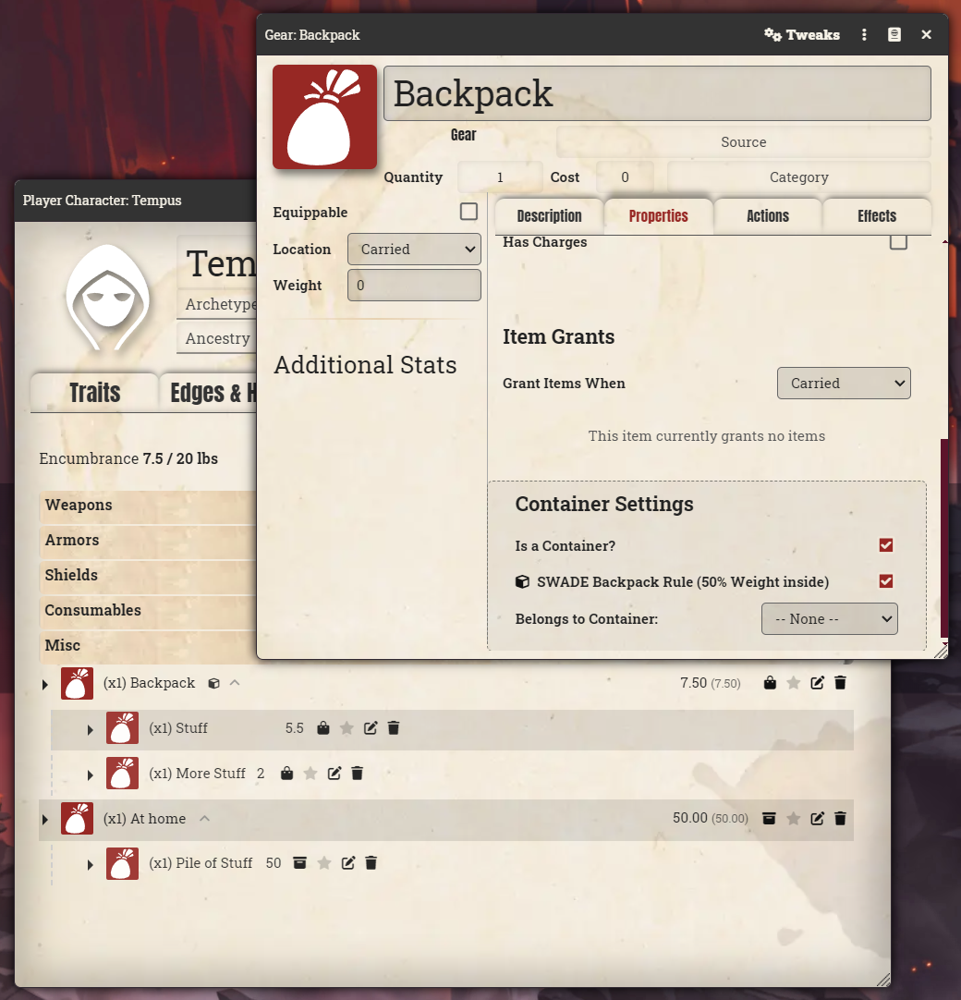

# SWADE Containers

A solution for inventory organization in Savage Worlds. Nest items inside backpacks, chests, and pouches directly within your character sheet to eliminate clutter.

### **Full Description:**

SWADE Containers enhances the standard SWADE actor sheet by allowing items to act as functional parents for other gear. Instead of a flat list of items, this module provides a hierarchical view that makes managing complex inventories simple and visual.

### **How it Works:**

1.  **Create a Container:** Open any item (e.g., "Backpack"), go to **Properties**, and check **Is a Container?**.
2.  **Fantasy Companion Rules:** Check SWADE Backpack to apply the 50% weight reduction to all items stored inside.
3.  **Folding:** Click the arrow icon next to a container name to collapse or expand its contents.
4.  **Organize Gear:** Drag any Gear or Consumable item and drop it directly onto your container's name to nest it.
5.  **Container Weight Link:** Setting a container to Stored automatically updates all nested items, ensuring weight totals are calculated correctly.

### **Installation:**
To install, import this manifest into the module browser or search for 'SWADE Containers'.

**Manifest URL:**
`https://raw.githubusercontent.com/ivan-hr/swade-containers/main/module.json`